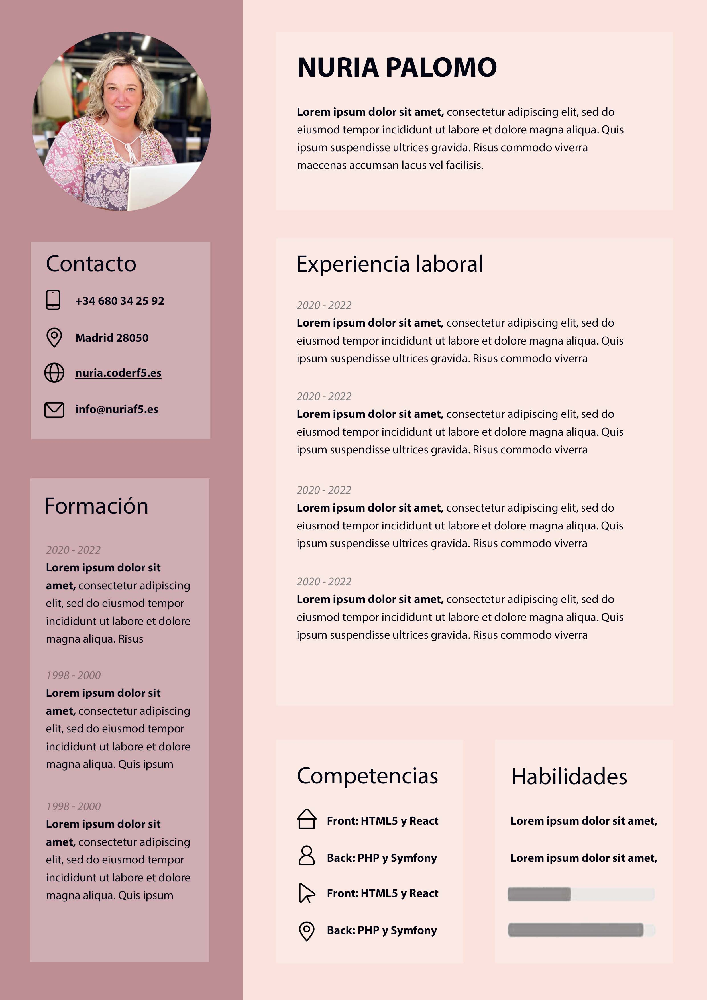
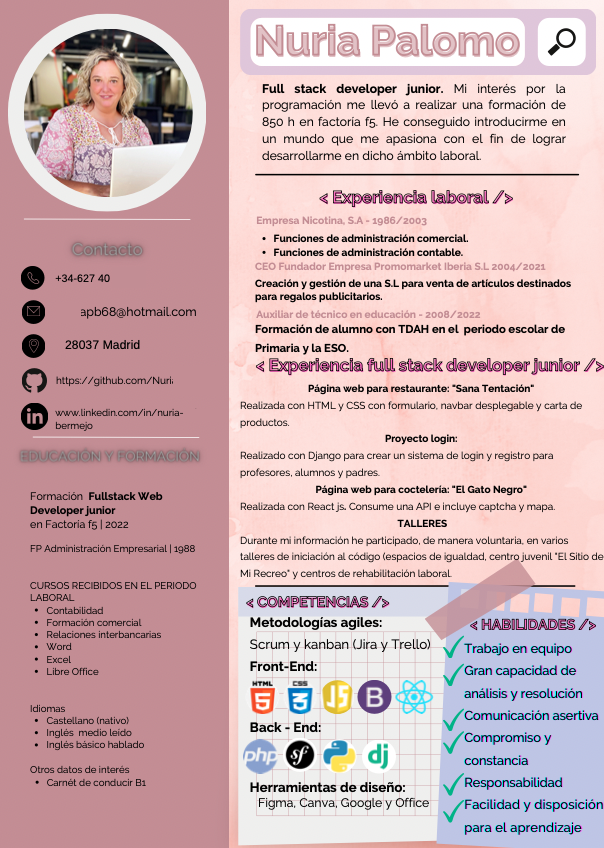
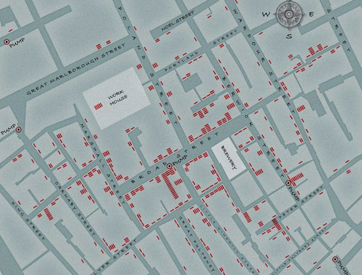
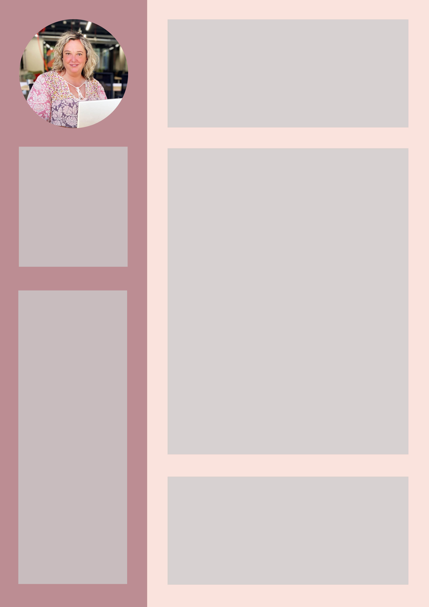
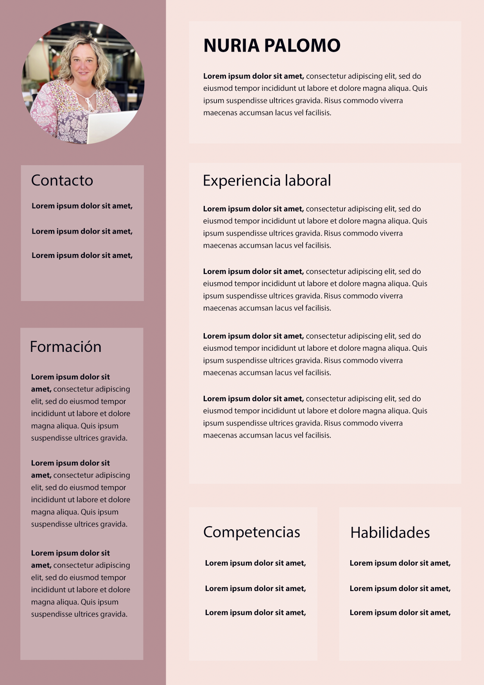
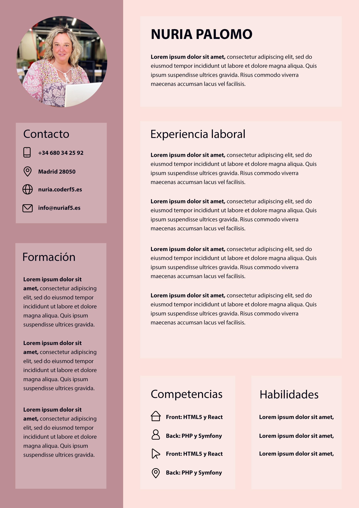
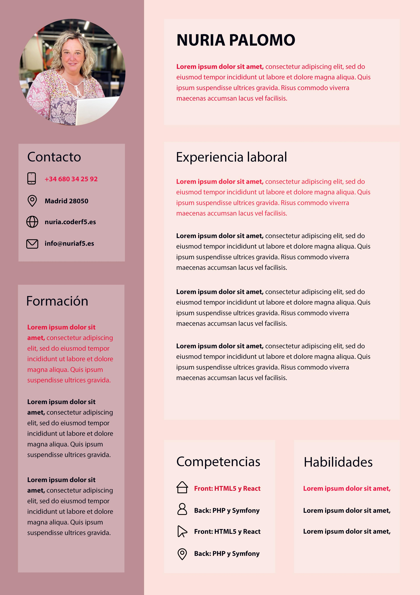
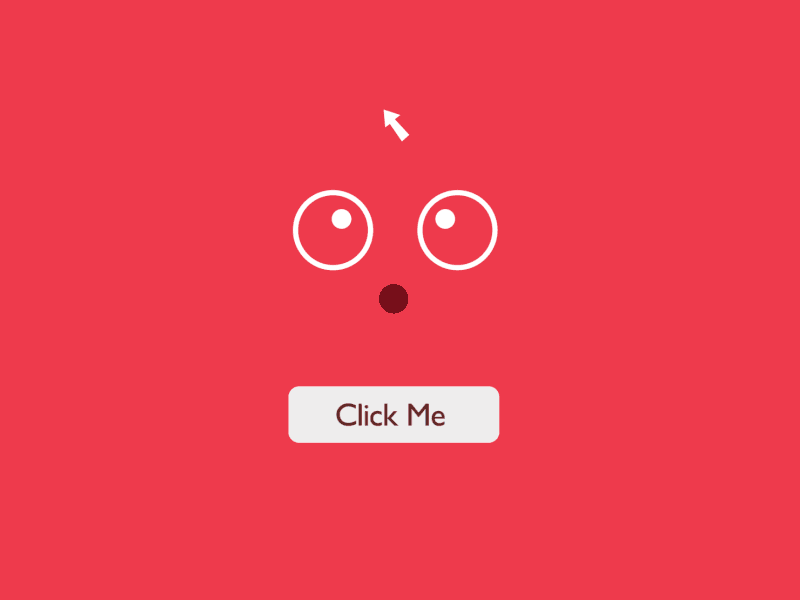

# 🖥️ Diseño de Interfaces

---

## 🎯 Índice

1. 🧐 ¿Qué diseño te parece más profesional?
2. 📝 ¿Qué es el diseño?
3. 📐 Principios del diseño
4. ⭐️ y una cosa más
5. 🎲 Más recursos

---

## 🧐 ¿Qué diseño te parece más profesional?

---

## Opción A

---

##  Opción B

---

Si la <strong>Opción A</strong> te parece más profesional vamos a explicar razones.

Si te parece mejor la <strong>Opción B</strong> quizás es porque te parece más "creativo". En ese caso, primero conoce y aplica los principios de diseño antes de buscar romper las reglas.

---

## 📝 ¿Qué es el diseño?

La palabra diseño proviene de "disegno" que en italiano significa dibujo. De esa raíz evolucionan palabras como "designar", "designio", "el porvenir", etc. Parece que el diseño es una pre-figuración de lo que será y de alguna manera está relacionado con el futuro.

<strong>En resumen: El diseño nos facilita la vida.</strong>

Un buen ejemplo sería la reproducción del mapa que realizó el Dr. John Snow para detectar la fuente de la epidemia del cólera. Soluciona un problema con elementos gráficos.

---

##  📐 Principios del diseño

En el caso del CV diseñamos para facilitar la vida a los reclutadores. Hay que utilizar todos los recursos disponibles para <strong>no hacer pensar al usuario</strong> y para ello tenemos en cuenta los mecanismos de la percepción.

Referencias: 
- "El diseño sigue a la función" Soluciona un problema. 🏫 [Principio desarrollado en la Bauhaus](https://es.wikipedia.org/wiki/Bauhaus)
- Libro de Steve Krug "No me hagas pensar"

---

##  📐 Principios > ✅ Simplificar

<strong>La simplicidad se trata de eliminar lo obvio y añadir lo que da significado.</strong>

La interfaz no debe contener información que no sea relevante o se utilice raramente, pues cada unidad adicional de información en un diálogo compite con las unidades relevantes de la información y disminuye su visibilidad.

Referencias:
- 📘 [Leyes de la simplicidad – John Maeda](https://lawsofsimplicity.com/)
- 🖼️ [Ejemplo visual de simplicidad (GIF)](https://jorgebenitezlopez.com/tiddlywiki/pro/simplicidad.gif)

---

##  📐 Principios >  🌈 Color

<strong>Diferencia claramente lo que es figura y lo que es fondo</strong>. Utilizar el color manteniendo una relación inversamente proporcional entre la saturación y la superficie que ha de ocupar el color.

<strong>Usar gamas que den entonaciones familiares y armónicas</strong>.
 
 Referencias:
- 🎨 [Colrd: Inspiración y paletas de color](http://colrd.com/)
- 🖌️ [Adobe Color Wheel: Herramienta para crear gamas de color](https://color.adobe.com/es/create/color-wheel)

---

##  📐 Principios >  📖 Estructura

Es importante crear una rejilla para mantener una relación entre los elementos, los márgenes, los paddings y los espacios vacíos. Piensa en cajas.

<strong>Queremos dar claridad al usuario, que no piense, que entienda la estructura fácilmente</strong>

Referencias:
- 🧩 [Leyes de la buena forma – Teoría de la Gestalt](https://es.wikipedia.org/wiki/Leyes_de_la_organización_perceptual): 

---

##  📐 Principios >  🅰️ Tipografía

Sigue los consejos tipográficos de Enric Jardí

- La familia tipográfica debe ajustarse a lo que queremos transmitir. ¿Moderna, manual, etc.?
- Evitar mayúsculas para textos largos.
- 2 familias por proyecto como mucho y que tengan contraste entre ellas.
- Preferiblemente alineación a la izquierda en bandera. Como Apple
- Columnas como las de un periódico o un libro, no más

---

##  📐 Principios >  🌄 Imágenes

Buscar cierta unidad en las imágenes

Referencias:
- Apple llevaba la unidad del diseño de los iconos a otro nivel. Los 'squircles' también están presentes en los bordes de los ordenadores y teléfonos de la manzana.

---

##  📐 Principios >  🎯 Prioriza

<strong>Lo más importante para el puesto al que aspiramos arriba y a la izquierda</strong>

 El patrón de diseño en forma de Z viene de la forma en que la mayoría de los usuarios escanean las pantallas de un producto digital.

Referencia:
- 🅱️ [Ejemplo visual del patrón de lectura en Z](https://jorgebenitezlopez.com/tiddlywiki/pro/lecturadeunaweb.jpg): 

---

##  📐 Principios >  🔎 Diseña la información

Diseñar los detalles del contenido que tiene que aparecer. Por ejemplo las fechas o el nivel de las habilidades.

Referencias:
- 🇬🇧 [UK Design Principles – Government Digital Service](https://www.gov.uk/guidance/government-design-principles)
- 📊 [Design with Data – Government Digital Service](https://www.gov.uk/service-manual/measuring-success/using-data-to-improve-your-service)

---

## ⭐️ Y una cosa más > Ten en cuenta la interacción

En la web tienes que tener en cuenta el <strong>diseño de interacción</strong>. Las cosas se adaptan, se ocultan, crecen, se despliegan... y recuerda que nos encanta la interacción.

Referencia:
- 🤝 [Interaction Design Association (IxDA)](https://ixda.org/)

---

## ⚠️ Y otro "detalle" más > Busca referencias

Evita el sesgo de unicidad: Creernos que nuestras situaciones son únicas.

Inspírate de las personas que te interesen. Haz una búsqueda.

Referencias:

- 🖼️ [Ejemplo de diseño creativo (Imagen 1)](https://i.pinimg.com/564x/48/f0/d7/48f0d7aace14bac184facf65e17051c9.jpg)
- 🖼️ [Ejemplo de diseño creativo (Imagen 2)](https://i.pinimg.com/564x/e2/91/a9/e291a9a749900974746a4fb01cbe67b7.jpg)
- 📹 [Video: Ejemplo de CV creativo](https://www.youtube.com/watch?v=uorBWRURYEQ)

---

## 🎉 Más recursos y juegos

- 🧠 [Las 10 heurísticas de Nielsen, principios de usabilidad (infografía)](https://jorgebenitezlopez.com/tiddlywiki/pro/10-nielsen-heuristic.png)
- 📄 [Norma ISO sobre experiencia de usuario (ISO 9241-210)](https://www.iso.org/standard/77520.html) 
- 🎮 [Juego: ¿Puedes notar la diferencia? (Cantunsee)](https://cantunsee.space/) 
- 💡 [Juego: The Last Designer](https://www.thelastdesigner.art/) 
- 🎨 [Guía oficial de Material Design](https://m2.material.io/design) 

---

## 🎉 ¡Gracias!

- 👤 [LinkedIn: Jorge Benítez López](https://www.linkedin.com/in/jorgebenitezlopez/)

